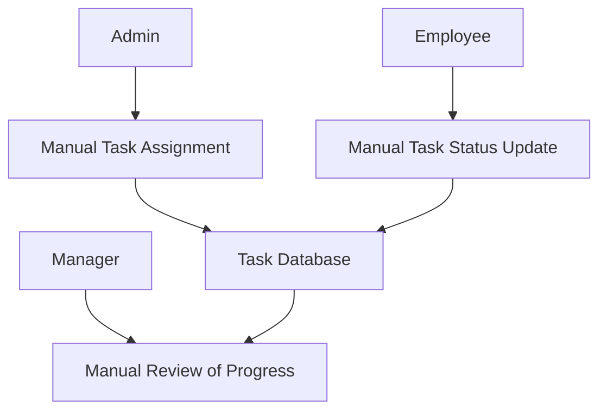
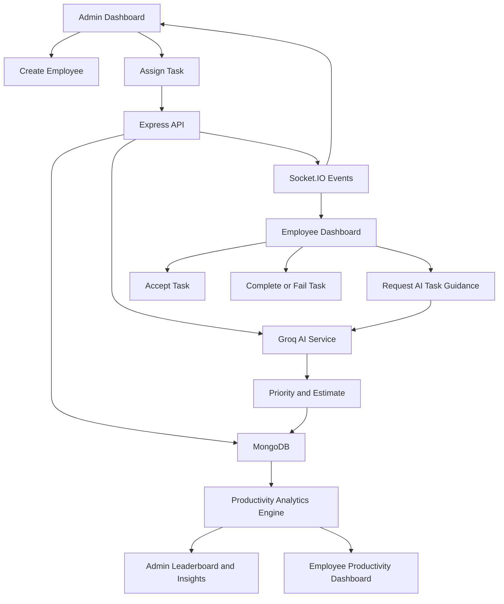
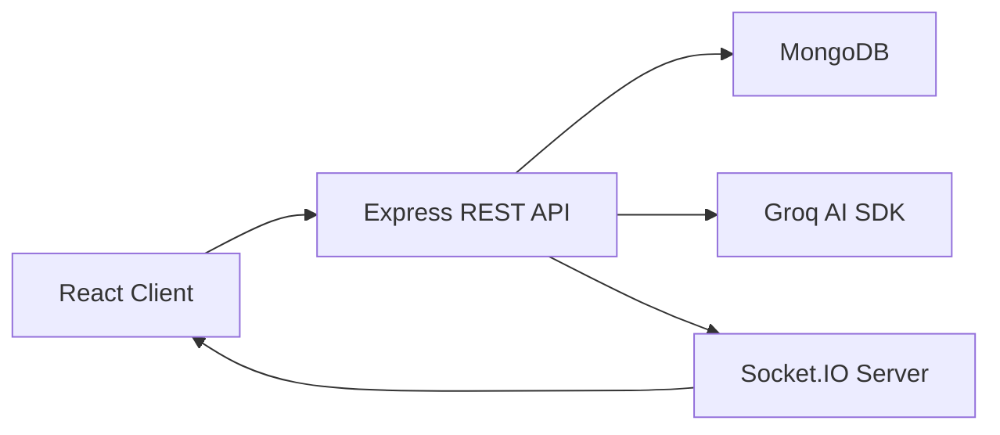

# AI-Driven Task Management with Productivity Pattern Research

## Final Year Capstone Project Report Draft

This document is a report-ready technical explanation of the project source code present in the `api`, `server`, and `client` folders. It is written so it can be expanded into a 50-60 page college capstone report by adding screenshots, diagrams, test-case tables, bibliography, and deployment screenshots.

---

## Suggested Table of Contents

1. Introduction
2. Problem Statement
3. Existing System
4. Proposed System
5. Problem Analysis
6. Software Requirement Analysis
7. System Design and Architecture
8. Database Schema and Data Design
9. Backend Implementation
10. AI Integration and Prompt Engineering
11. Productivity Analytics Engine
12. Frontend Implementation
13. Real-Time Communication
14. User Manual and UX Design Principles
15. Testing Strategy
16. Security Analysis and OWASP Mitigation
17. Deployment Architecture
18. Software Maintenance and Lifecycle Management
19. Project Legacy, Lessons Learned, and Future Scope
20. Source Code Structure
21. Conclusion

---

## 1. Introduction

### 1.1 Project Background

The project is a full-stack web application for employee task management enhanced with artificial intelligence and productivity pattern analysis. Traditional task management systems usually allow an administrator or manager to assign tasks and allow employees to mark them as completed. This project extends that idea by adding AI-assisted task priority detection, estimated duration analysis, employee productivity statistics, leaderboard-based comparison, task explanation, checklist generation, and dashboard-level insights.

The system is built using the MERN-style architecture:

- Frontend: React with Vite, Tailwind CSS, Recharts, Socket.IO client, and Axios.
- Backend: Node.js, Express.js, MongoDB, Mongoose, Socket.IO, and Groq AI SDK.
- Database: MongoDB with Mongoose schemas for employees, admins, and embedded tasks.
- Deployment: Vercel-compatible serverless API entry point with frontend static build output.

The project has three important source folders:

- `api`: Vercel serverless API entry point.
- `server`: Express backend, MongoDB models, AI routes, productivity routes, and utility logic.
- `client`: React frontend application.

### 1.2 Objectives

The main objectives of the project are:

- To provide a digital platform where admins can create employees and assign tasks.
- To support employee login and first-time password setup.
- To track task lifecycle states: new, active, completed, failed, not accepted, and deleted.
- To automatically calculate task counts and status changes.
- To use AI for task priority classification and estimated duration prediction.
- To provide AI-generated task explanations and step-by-step task guidance.
- To calculate productivity statistics such as completion rate, productivity score, on-time percentage, average completion time, and weekly trend.
- To provide an admin dashboard for comparing employees through leaderboard and team insights.
- To support real-time dashboard updates with Socket.IO when data changes.
- To cache AI insights where possible to reduce repeated AI calls and improve system performance.

### 1.3 Scope of the Project

The scope includes:

- Admin authentication.
- Employee authentication.
- Employee onboarding through password setup.
- Employee creation by admin.
- Task assignment by admin.
- AI priority and time estimation.
- Task acceptance deadline tracking.
- Task completion deadline tracking.
- Employee productivity dashboard.
- Admin team productivity dashboard.
- Leaderboard and comparative analytics.
- AI-powered employee and admin insights.
- Real-time update events.
- Vercel serverless API support.

The scope does not currently include:

- Password hashing.
- JWT or session-based authorization.
- Role-based API middleware.
- File attachments.
- Email notifications.
- Full audit log.
- Unit test suite.
- Multi-organization tenancy.

These limitations are useful to mention in the future scope and security sections.

---

## 2. Problem Statement

Organizations often assign tasks to employees but lack intelligent visibility into how those tasks are performed. Many systems can show whether a task is completed or pending, but they do not answer important management questions such as:

- Which employee is consistently completing work on time?
- Which employee is overloaded?
- Which tasks are urgent?
- Which tasks need more time?
- What work pattern is visible from task completion data?
- Which employee is improving or declining?
- What task guidance should an employee follow after accepting a task?

Manual monitoring is slow, subjective, and often inaccurate. This project solves the problem by building a centralized task management system that automatically tracks task status, computes productivity metrics, and uses AI to generate task-level and employee-level insights.

---

## 3. Existing System

### 3.1 Introduction

Existing task management systems generally provide task lists, due dates, status tracking, and sometimes comments. Examples include Trello, Asana, Jira, ClickUp, and simple internal employee management portals.

### 3.2 Limitations of Existing Systems

Common limitations are:

- Priority is mostly entered manually.
- Productivity reports are often generic and require manual interpretation.
- Task guidance is not generated automatically.
- Managers need to manually compare employees.
- Many simple employee systems do not provide real-time updates.
- Most systems do not convert task history into behavioral productivity patterns.

### 3.3 What Is New in This System

This project introduces:

- AI-based task priority detection.
- AI-based task duration estimation.
- AI-generated task explanation and checklist.
- Productivity score calculation.
- On-time and delayed task analysis.
- Recent weekly trend comparison.
- Admin competitive leaderboard.
- AI-backed admin recommendations.
- Automatic timeout handling for unaccepted and overdue active tasks.
- Real-time UI refresh through Socket.IO events.

### 3.4 Present System DFD



### 3.5 Proposed System DFD



---

## 4. Problem Analysis

### 4.1 Product Definition

The product is an AI-driven employee task management and productivity research platform. It helps administrators assign tasks and monitor employee productivity, while employees receive task lists, deadlines, AI insights, and completion workflows.

### 4.2 Feasibility Analysis

Technical feasibility:

- React and Express are mature technologies.
- MongoDB is suitable because employee documents contain embedded task arrays.
- Mongoose schemas provide validation and structure.
- Groq AI integration allows natural language analysis without building a local machine learning model.
- Socket.IO enables real-time communication during local Node server execution.

Operational feasibility:

- Admins can create employees and assign tasks.
- Employees can log in and update status without technical knowledge.
- Dashboards summarize complex analytics visually.

Economic feasibility:

- Open-source frontend/backend stack reduces cost.
- MongoDB Atlas free/shared tiers can support student project deployment.
- Groq API can be configured using an API key and guarded through local rate limiting.

Schedule feasibility:

- The system is modular enough to divide into authentication, task management, AI integration, analytics, UI, and deployment phases.

### 4.3 Project Plan

Recommended project phases:

1. Requirement collection and module identification.
2. Database schema design.
3. Backend CRUD API development.
4. Authentication and employee onboarding.
5. React dashboard development.
6. AI priority and task explanation integration.
7. Productivity analytics implementation.
8. Real-time update support.
9. Deployment configuration.
10. Testing and documentation.

---

## 5. Software Requirement Analysis

### 5.1 Functional Requirements

Admin requirements:

- Admin can log in.
- Admin can view all employees.
- Admin can add a new employee.
- Admin can assign tasks to employees.
- Admin can view team-level productivity KPIs.
- Admin can view leaderboard rankings.
- Admin can view AI-powered team insights.

Employee requirements:

- Employee can log in after password setup.
- Employee can sign up only if admin has already created the employee email.
- Employee can view assigned tasks.
- Employee can accept new tasks.
- Employee can mark active tasks as completed or failed.
- Employee can view AI task guidance.
- Employee can view productivity stats and charts.

AI requirements:

- System should classify priority as High, Medium, or Low.
- System should generate a priority reason.
- System should estimate duration in minutes when not manually supplied.
- System should explain tasks with summary, steps, and estimated time.
- System should generate employee productivity insights.
- System should generate admin comparative insights.
- System should fall back to rule-based logic when AI is unavailable.

Analytics requirements:

- Calculate completion rate.
- Calculate productivity score.
- Calculate average completion time.
- Calculate on-time percentage.
- Calculate delayed percentage.
- Calculate completed tasks in current and previous 7-day windows.
- Determine trend as Improving, Stable, or Declining.
- Generate chart data for tasks per day and completion duration.

### 5.2 Non-Functional Requirements

- Usability: responsive dashboard interface with dark/light theme support.
- Reliability: fallback logic when AI or DB fails.
- Performance: caching for AI insights and retry logic for API requests.
- Maintainability: separation between API client, routes, schemas, and components.
- Scalability: MongoDB and serverless deployment support.
- Availability: `/api/health` route remains available even if DB is unreachable.

---

## 6. System Design and Architecture

### 6.1 Architectural Paradigm

The system follows a client-server architecture.



The frontend is responsible for:

- Rendering UI.
- Managing local component state.
- Calling REST APIs.
- Listening for real-time events when enabled.
- Storing logged-in user state in browser local storage.

The backend is responsible for:

- Database connection.
- Data validation.
- Employee and admin authentication.
- Task lifecycle updates.
- AI integration.
- Analytics calculation.
- Real-time event emission.

### 6.2 Deployment Architecture

The `vercel.json` file configures:

- Frontend build command: `cd client && npm install && npm run build`
- Output directory: `client/dist`
- API function: `api/index.js`
- Route rewrite from `/api/(.*)` to `/api/index.js`
- SPA rewrite from all other routes to `/index.html`

The `api/index.js` file imports the Express app from `server/server.js` and exposes it as a Vercel serverless handler. It connects to the database before most API requests, except `/api/health`, which is intentionally allowed without database connection.

---

## 7. Database Schema and Data Design

### 7.1 Task Schema

Defined in `server/models.js`.

Important task fields:

- `active`: task is currently being worked on.
- `newTask`: task is newly assigned and waiting for acceptance.
- `completed`: task finished successfully.
- `failed`: task failed or exceeded completion deadline.
- `notAccepted`: task was not accepted within allowed time.
- `taskTitle`: title of task.
- `taskDescription`: details of task.
- `taskDate`: due date.
- `category`: work category.
- `aiPriority`: AI-classified priority: High, Medium, Low.
- `aiPriorityReason`: explanation for assigned priority.
- `aiEstimationPending`: whether AI duration estimation is still pending.
- `assignedAt`, `createdAt`, `acceptedAt`, `startedAt`, `submittedAt`, `completedAt`: lifecycle timestamps.
- `complexity`: task complexity from 1 to 5.
- `estimatedDuration`: estimated minutes for completion.
- `acceptanceTimeLimitMinutes`: time allowed to accept the task.
- `acceptanceDeadline`: computed acceptance deadline.
- `effortLevel`: employee effort rating.
- `cognitiveLoadScore`: optional cognitive workload score.
- `completionTime`: actual completion time in minutes.
- `onTime`: whether completed before deadline.
- `explainSummary`, `explainSteps`, `explainEstimatedTime`: cached AI guidance.
- `isDeleted`, `deletedAt`: soft-delete mechanism.

### 7.2 Employee Schema

Important employee fields:

- `firstName`, `lastName`, `email`
- `password`
- `role`
- `isFirstLogin`
- `isPasswordSet`
- `isActivated`
- `taskCounts`: object containing active, newTask, completed, failed counts.
- `tasks`: embedded array of task documents.
- `storedInsights`: cached employee AI insights.
- `storedChartData`: cached chart data.
- `lastInsightUpdate`, `lastChartUpdate`: cache timestamps.

### 7.3 Admin Schema

The admin schema stores:

- `email`
- `password`

### 7.4 Database Design Note

Tasks are embedded inside the employee document. This design makes it easy to load one employee with all assigned tasks. It is suitable for a capstone project and moderate task volume. For large enterprise usage, tasks could be moved to a separate collection with employee references.

---

## 8. Backend Implementation

### 8.1 `api/index.js`

This is the Vercel serverless adapter.

Main functionality:

- Imports Express app and database connector.
- Reads request path.
- Skips DB connection for `/api/health`.
- Calls `connectDB()` for other API requests.
- Passes request to Express app.
- Catches bootstrap errors and returns structured JSON.
- Identifies likely MongoDB failures and returns status `503`.

This file is important because Vercel does not run a traditional long-lived Express server. Instead, each request enters through the serverless handler.

### 8.2 `server/server.js`

This is the central backend file. It performs:

- Express app setup.
- Middleware registration.
- MongoDB connection handling.
- Socket.IO setup for non-Vercel runtime.
- Health endpoints.
- Employee creation.
- Authentication.
- Employee fetching and updating.
- Task assignment.
- AI route mounting.
- Productivity route mounting.
- Admin login.
- Local server startup.

Important helper functions:

- `redactMongoUri(uri)`: hides the MongoDB password when logging.
- `serializeError(err)`: converts an error into safe diagnostic fields.
- `toTaskDeadline(taskDateValue)`: converts due date into a Date object and treats date-only values as end-of-day.
- `computeOnTime(completedAt, taskDateValue)`: checks if a completed task finished before deadline.
- `buildTaskIdentityKey(task)`: creates a stable key for comparing tasks when `_id` is not available.
- `resolveTaskStartTime(task)`: chooses the best available start timestamp.
- `resolveCompletionTimeMinutes(task, completedAt)`: calculates actual completion duration.
- `isValidDate(value)`: verifies if a date can be parsed.
- `computeTaskCounts(tasks)`: counts active, new, completed, and failed visible tasks.
- `clampDurationMinutes(minutes)`: limits duration between 10 and 480 minutes.
- `parseDurationStringToMinutes(value)`: converts strings like `1 hour`, `30 minutes`, or `1-2 hours` into minutes.
- `normalizeEstimatedDurationMinutes(rawValue, fallbackMinutes)`: converts raw AI/manual estimate into safe minute value.
- `computeFallbackEstimatedDurationMinutes(task)`: estimates duration using complexity, description length, and category.
- `extractEstimatedDurationCandidate(payload)`: reads duration from possible AI JSON keys.
- `normalizePriorityValue(value)`: ensures priority is High, Medium, or Low.
- `enrichTaskAiMetadataInBackground(...)`: updates task priority and estimate after task creation using AI.
- `applyTaskTimeouts(employeeOrUpdate)`: marks tasks as not accepted or failed when deadlines expire.
- `normalizeExplainPayload(parsed, fallback)`: validates AI task explanation.
- `generateAndCacheTaskGuidance(...)`: background task guidance generation, currently not automatically used on task creation.
- `connectDB()`: connects to MongoDB with timeout settings and reused promise.
- `startServer()`: starts local Node server when not running on Vercel.

### 8.3 Main Backend Routes

`GET /api/health`

- Returns application health.
- Shows DB connection state.
- Shows whether important environment variables exist.
- Does not force database connection.

`GET /api/health/db`

- Actively tests MongoDB connection.
- Returns success or DB failure details.

`POST /api/employees`

- Creates a new employee.
- Requires first name and email.
- Normalizes email.
- Prevents duplicate employees.
- Creates employee with empty tasks and zero task counts.
- Emits `employeeUpdated` real-time event.

`POST /api/auth/login`

- Handles both admin and employee login.
- Checks admin first.
- Finds employee by email.
- If employee password is not set, returns `requiresPasswordSetup`.
- If password matches, returns employee data.

`POST /api/auth/set-password`

- Allows first-time employee password setup.
- Requires email and password.
- Requires password length of at least 6.
- Marks employee as activated.

`POST /api/auth/signup`

- Similar to password setup.
- Allows signup only when employee already exists in database.
- Prevents public self-registration of unknown employees.

`GET /api/employees`

- Returns all employees.

`GET /api/employees/:email`

- Returns one employee by email.
- Applies timeout logic before returning employee.
- Saves timeout changes if needed.

`PUT /api/employees/:email`

- Updates an employee document.
- Preserves auth fields when partial update is sent.
- Detects newly added tasks in full employee update payload.
- Adds AI priority for new tasks.
- Updates completion metadata.
- Detects status transitions to completed or failed.
- Clears stale stored insights after task outcome changes.
- Emits real-time update events.

`POST /api/employees/:email/tasks`

- Adds a new task to an employee.
- Sets assignment and creation timestamps.
- Computes acceptance deadline if applicable.
- Saves task immediately with medium priority placeholder.
- Emits `taskCreated`.
- Starts background AI priority and duration enrichment.

`POST /api/admin/login`

- Legacy/admin-specific login route.
- Checks admin email and password.

---

## 9. AI Integration and Prompt Engineering

### 9.1 `server/api/gemini/geminiClient.js`

Although filenames use `gemini`, the actual implementation uses the Groq SDK. The default model is `llama-3.1-8b-instant`.

Important functionality:

- `hasAiClientConfig()`: checks if `GROQ_API_KEY` is configured.
- `callGemini(prompt, options)`: sends prompt to Groq chat completions API.
- `safeParseJson(text, fallback)`: safely extracts JSON from AI output.
- `recordAiFallback(context)`: records when the system used fallback instead of AI.
- `getAiTelemetrySnapshot()`: returns counts of AI calls, failures, retries, rate limits, and average latency.
- `getRetryAfterMs(err)`: extracts retry delay from headers or messages.
- `isGeminiRateLimited(err)`: detects HTTP 429.

Reliability features:

- Prompt compaction through `MAX_PROMPT_CHARS`.
- Local per-minute rate guard.
- In-flight lock to prevent duplicate AI calls for same key.
- Timeout handling.
- Retry for rate limit and server errors.
- Telemetry for monitoring.

### 9.2 `server/api/gemini/geminiPrompts.js`

This file contains prompt builders:

- `buildPriorityPrompt(...)`: asks AI to classify priority and estimate duration.
- `buildExplainTaskPrompt(...)`: asks AI to explain task and generate steps.
- `buildAdminLeaderboardPrompt(...)`: older/simple leaderboard prompt.
- `buildDailyReportPrompt(...)`: daily productivity reflection prompt.
- `buildRuleBasedTaskGuidance(...)`: fallback explanation without AI.
- `buildEmployeeInsightsPrompt(...)`: employee pattern insight prompt.
- `buildAdminCompetitiveInsightsPrompt(...)`: admin/team insight prompt.

The prompts are designed to return compact JSON only. This is important because the backend parses AI output using `JSON.parse`.

### 9.3 `server/api/gemini/geminiRoutes.js`

Routes:

`GET /api/gemini/monitoring`

- Returns AI telemetry.

`POST /api/gemini/priority`

- Accepts task title, description, and metadata.
- Builds priority prompt.
- Calls AI service.
- Returns priority, reason, and raw AI response.
- Falls back to Medium priority if AI fails.

`POST /api/gemini/explain-task`

- Accepts employee email, task ID or lookup fields, title, description, and metadata.
- Checks if task already has cached explanation.
- Uses cooldown and in-flight request maps.
- Calls AI for task summary, steps, and estimated time.
- Saves explanation back into employee task.
- Emits real-time events when explanation is generated.
- Uses rule-based guidance if AI fails.

---

## 10. Productivity Analytics Engine

### 10.1 `server/api/productivityRoutes.js`

This file computes employee and team productivity. It contains both formula-based analytics and AI-enhanced insights.

Important constants:

- `CHART_WINDOW_DAYS = 14`
- `AI_INSIGHTS_TTL_MS = 10 minutes`
- `ADMIN_INSIGHTS_TTL_MS = 10 minutes`

Important helper functions:

- `isVisibleTask(task)`: excludes deleted and not accepted tasks.
- `getVisibleTasks(tasks)`: filters task array.
- `classifyTrend(...)`: labels productivity as Improving, Stable, or Declining.
- `buildConsistencyReport(...)`: checks dashboard totals against leaderboard totals.
- `isFresh(dateValue, ttlMs)`: validates cache freshness.
- `toDayKey(date)`: formats date as YYYY-MM-DD.
- `parseDayKey(dayKey)`: parses YYYY-MM-DD.
- `formatDayLabel(date)`: creates labels like Apr 27.
- `getWindowStart(days)`: returns starting date for chart window.
- `getTaskDeadline(taskDate)`: parses task due date.
- `resolveOnTime(task)`: determines whether task completed before deadline.
- `resolveCompletionTimeMinutes(task)`: calculates completion duration.
- `computeTaskCounts(tasks)`: calculates task status counts.
- `applyTaskTimeouts(tasks)`: updates expired new/active tasks.
- `normalizeEmployeeTaskTimeouts(employee)`: persists timeout changes.
- `computeTaskFormulaMetrics(tasks)`: calculates total, completed, failed, completion rate, productivity score, and average completion time.
- `toStatusLabel(task)`: converts task flags to a status string.
- `getActivityTimestamp(task)`: chooses best timestamp for recent activity.
- `buildRecentActivity(tasks)`: creates recent activity list.
- `buildCompletionTimeSamples(tasks)`: creates recent completion duration samples.
- `normalizeInsightsList(raw, max)`: validates insight arrays.
- `normalizeEmployeeAiAnalysis(raw)`: validates employee AI output.
- `normalizeAdminInsights(raw)`: validates admin AI output.
- `buildEmployeeInsightsInput(...)`: prepares structured data for AI.
- `computeTeamBaselineSnapshot(...)`: compares employee to peers.
- `generateDataDrivenInsights(input)`: creates rule-based insights from metrics.
- `contradictsCoreMetrics(line, metrics)`: prevents AI from contradicting actual stats.
- `mergeWithAuthoritativeInsights(input, aiInsights)`: merges AI insights with factual insights.
- `buildEmployeePatternFallback(input)`: creates fallback employee analysis.
- `hasRecentOutcomeSince(tasks, lastInsightUpdate)`: checks if cache is stale after recent task outcome.
- `buildLowDataEmployeeAnalysis(input)`: handles low-data cases.
- `generateAdminDataDrivenInsights(...)`: creates team-level fallback insights.
- `reconcileAdminInsights(...)`: combines AI candidate with factual fallback.
- `buildAdminInsightsSignature(...)`: creates cache signature.
- `computeStats(employee)`: main employee statistics function.

### 10.2 Productivity Formulas

Completion rate:

```text
completionRate = completedTasks / totalVisibleTasks * 100
```

Productivity score:

```text
productivityScore = completedTasks * 2 - failedTasks
```

Average completion time:

```text
averageCompletionTimeMinutes = sum(completionTimeMinutes) / completedTasks
```

Trend delta:

```text
productivityTrendDelta = completedLast7Days - completedPrevious7Days
```

On-time percent:

```text
onTimePercent = onTimeCompletedTasks / completedTasks * 100
```

### 10.3 Productivity Routes

`GET /api/productivity/monitoring`

- Returns AI telemetry, in-flight counters, cache entries, and generated timestamp.

`GET /api/productivity/rankings`

- Loads all employees.
- Applies timeout normalization.
- Computes leaderboard stats.
- Sorts employees by productivity score.
- Computes team dashboard summary.
- Builds AI or fallback admin insights.
- Uses cache and cooldown logic.
- Returns leaderboard, summary, consistency report, insights, AI status, and cache status.

`GET /api/productivity/:employeeId/stats`

- Loads employee by ID.
- Applies timeouts.
- Returns computed productivity stats.

`GET /api/productivity/:employeeId/chart-data`

- Loads employee by ID.
- Builds tasks-per-day chart entries.
- Builds completion duration scatter points.
- Stores chart data in MongoDB.
- Returns chart data.

`GET /api/productivity/:employeeId/insights`

- Loads employee and all peer task data.
- Computes employee stats.
- Computes team baseline.
- Handles low-data cases.
- Uses cached insights when fresh.
- Uses AI if configured.
- Uses fallback if AI fails or is rate limited.
- Stores new insights in MongoDB.

---

## 11. Frontend Implementation

### 11.1 Client Entry Files

`client/src/main.jsx`

- Creates React root.
- Wraps application in `AuthProvider`.
- Renders `App`.
- Uses React StrictMode.

`client/src/App.jsx`

Main responsibilities:

- Reads saved logged-in user from local storage.
- Handles login.
- Handles signup/password activation.
- Routes user to:
  - `Login` when unauthenticated.
  - `AdminDashboard` for admin.
  - `EmployeeDashboard` for employee.
- Uses `parseApiPayload` to safely parse JSON or text API responses.

`client/src/context/AuthProvider.jsx`

Responsibilities:

- Provides `AuthContext`.
- Optionally prefetches employees if `VITE_ENABLE_AUTH_PREFETCH=true`.
- Optionally connects to Socket.IO if `VITE_ENABLE_REALTIME=true`.
- Updates employee data on events:
  - `employeeUpdated`
  - `taskCreated`
  - `taskExplanationGenerated`
  - `taskStatusChanged`

`client/src/lib/apiClient.js`

Responsibilities:

- Defines base API URL.
- Provides retry wrapper for GET, POST, and PUT.
- Retries on 429, 500, 502, 503, and 504.
- Sanitizes API error messages for user display.

`client/src/lib/realtime.js`

Responsibilities:

- Enables/disables real-time mode from environment variable.
- Defines Socket.IO URL.
- Defines transport, reconnection attempts, and timeout.

### 11.2 Authentication Components

`Login.jsx`

Features:

- Two modes: sign in and sign up.
- Sign-in form sends email/password to parent `handleLogin`.
- Signup form validates confirm password.
- Signup is used for employees already created by admin.
- Shows error and loading state.

`SetPassword.jsx`

Features:

- Password and confirm password form.
- Validates minimum length.
- Calls `onSubmit` with new password.
- This component exists but the current `App.jsx` login flow mainly sends users to signup for activation.

### 11.3 Admin Dashboard

`AdminDashboard.jsx`

This is the main admin interface.

Important behavior:

- Maintains dark/light theme.
- Fetches employees and productivity rankings.
- Fetches AI insights separately and refreshes them in the background.
- Polls dashboard data at intervals.
- Uses Socket.IO events when real-time is enabled.
- Allows admin to add new employees.
- Displays team KPIs, employee cards, leaderboard data, AI recommendations, and comparison rows.

Important functions:

- `toPercent(value, base)`: calculates safe percentage.
- `getTrendMeta(stats)`: determines visual metadata for trend.
- `deriveStrengthTags({ ranking })`: creates tags such as punctuality or throughput signals.
- `getTaskActivityTimestamp(task)`: selects date for recent task ordering.
- `deriveCardSignalFallback(stats)`: creates fallback signal text for employee card.
- `fetchDashboardData({ includeAI })`: loads `/employees` and `/productivity/rankings`.
- `refreshAiInsights()`: refreshes rankings with AI included.
- `scheduleAiRefresh()`: delays AI refresh to avoid excessive calls.
- `handleAddEmployeeInput(event)`: updates add employee form.
- `handleAddEmployee(event)`: posts new employee to backend.

`AdminCompetitivePole.jsx`

- Fetches productivity rankings.
- Displays comparative leaderboard visualization.
- Refreshes on relevant real-time events.

`AdminEmployeeProductivity.jsx`

- Shows one employee's productivity stats, chart data, and insights.
- Calls:
  - `/productivity/:employeeId/stats`
  - `/productivity/:employeeId/chart-data`
  - `/productivity/:employeeId/insights`
- Refreshes from Socket.IO task events.

`AdminInsightsPanel.jsx`

- Displays AI status and task-level AI information.
- Groups employee task insight visibility.
- Allows expanding task details.

`AdminProductivityLeaderboard.jsx`

- Renders leaderboard table.
- Shows employee rank, scores, completion metrics, and AI signals.

### 11.4 Employee Dashboard

`EmployeeDashboard.jsx`

Responsibilities:

- Fetches current employee data by email.
- Polls employee data periodically.
- Updates from real-time task events.
- Maintains theme.
- Computes focus tasks by priority and date.
- Computes next action recommendation.
- Computes weekly summary.
- Renders:
  - Header
  - Task count cards
  - Productivity dashboard
  - Task list

Important helpers:

- `getPriorityWeight(priority)`: High > Medium > Low.
- `getTaskDateTs(task)`: parses date for ordering.
- `getWeekBounds()`: calculates current and previous week windows.
- `fetchEmployee({ silent })`: refreshes employee data from API.
- `handleAccept()`: triggers refresh after accepting a task.

### 11.5 Task Components

`TaskList.jsx`

Responsibilities:

- Filters tasks by all/new/active/completed/failed.
- Hides deleted and not accepted tasks.
- Sorts tasks by timestamp and priority.
- Manages custom horizontal scrollbar.
- Opens AI explanation modal.
- Caches explained task IDs in local storage.
- Sends `/api/gemini/explain-task` requests.
- Highlights task after modal close.

Important helpers:

- `getTaskId(task)`: gets stable identifier.
- `matchesFilter(task, filter)`: filter logic.
- `getTaskTimestamp(task)`: chooses best timestamp for sorting.
- `hasValidExplanation(payload)`: validates explanation payload.
- `handleExplain(task)`: loads cached or API-generated task explanation.
- `handleTrackClick(event)`: scrollbar track navigation.
- `handleThumbPointerDown(event)`: scrollbar drag start.
- `handleListWheel(event)`: horizontal scroll behavior.
- `handleCloseModal()`: closes modal and refocuses task.

`NewTask.jsx`

Responsibilities:

- Displays a newly assigned task.
- Shows acceptance deadline countdown.
- Automatically marks task as not accepted if deadline expires.
- Allows accepting task.
- Can also mark task completed/failed.

Important functions:

- `computeTaskCounts(tasks)`: recalculates counts.
- `markTaskAsNotAccepted()`: updates task when acceptance deadline expires.
- `acceptHandler()`: changes task from new to active.
- `updateTaskStatus(statusType)`: completes or fails a task.

`AcceptTask.jsx`

Responsibilities:

- Displays active accepted task.
- Allows employee to mark completed or failed.
- Loads AI insights and checklist.
- Stores checklist progress in local storage.
- Updates task status on backend.

Important helpers:

- `makeTaskIdentity(task)`: creates task identity.
- `buildCacheKey(task)`: local storage cache key.
- `normalizeSteps(steps)`: validates AI step list.
- `buildChecklistItems(steps, checkedMap)`: converts AI steps into checklist.
- `toSummaryPoints(summary)`: creates summary bullet points.
- `readCachedInsight(cacheKey)`: reads local cached AI guidance.
- `writeCachedInsight(cacheKey, payload)`: stores guidance and checklist progress.
- `updateTaskStatus(statusType)`: updates task to completed or failed.
- `loadInsights()`: calls AI explain-task endpoint.
- `toggleChecklistItem(itemId)`: marks checklist item complete/incomplete.

`CompleteTask.jsx`

Responsibilities:

- Displays completed task.
- Shows completion duration.
- Supports soft delete.
- Allows viewing AI explanation.

Important functions:

- `formatCompletionDuration(minutes)`: converts minutes into readable duration.
- `handleDelete()`: sets `isDeleted` and `deletedAt`, then updates counts.

`FailedTask.jsx`

Responsibilities:

- Displays failed task.
- Supports soft delete.
- Allows viewing AI explanation.

`TaskAIInsight.jsx`

Responsibilities:

- Shows AI insight text in compact form.
- Detects overflow.
- Opens expanded modal when content is longer.
- Handles Escape key and body overflow.

`TaskDeadlineTimer.jsx`

Responsibilities:

- Shows remaining time for acceptance or completion.
- Parses estimated durations from numeric or text values.
- Shows pending AI estimation state.
- Updates every second when countdown is active.

### 11.6 Other UI Components

`CreateTask.jsx`

- Form used for assigning tasks.
- Collects employee email, title, description, date, category, estimated duration, complexity, and acceptance time limit.
- Posts task to `/api/employees/:email/tasks`.

`Header.jsx`

- Displays greeting and navigation labels.
- Handles logout by removing `loggedInUser` from local storage and reloading page.

`TaskListNumbers.jsx`

- Displays task count summary cards.
- Uses icons for new, completed, active, and failed tasks.

`AllTask.jsx`

- Older/simple component that renders all employees and their task counts from `AuthContext`.

`localStorage.jsx` in `src/utils`

- Contains demo employee and admin data for older local-storage based version.
- Provides `setLocalStorage()` and `getLocalStorage()`.
- The current application primarily uses MongoDB API instead of this old local storage dataset.

---

## 12. Real-Time Communication

Socket.IO is configured in `server/server.js` for traditional Node runtime when `process.env.VERCEL` is not set.

Backend emits:

- `employeeUpdated`
- `taskCreated`
- `taskAiUpdated`
- `taskExplanationGenerated`
- `taskStatusChanged`
- `taskActionCompleted`

Frontend listens in:

- `AuthProvider.jsx`
- `AdminDashboard.jsx`
- `AdminCompetitivePole.jsx`
- `AdminEmployeeProductivity.jsx`
- `EmployeeDashboard.jsx`

Purpose:

- Keep admin and employee dashboards synchronized.
- Refresh charts and insights after task completion/failure.
- Update task AI metadata after background AI enrichment.

Important deployment note:

- Socket.IO works best in a long-running Node server environment.
- Vercel serverless functions are not ideal for persistent Socket.IO connections.
- The project includes real-time feature flags so it can be disabled on serverless deployment.

---

## 13. User Manual

### 13.1 Admin Flow

1. Open the application.
2. Sign in using admin credentials stored in the database.
3. View dashboard KPIs and employee cards.
4. Add employee with first name, last name, email, and role.
5. Assign tasks using employee email and task details.
6. Review leaderboard and productivity analytics.
7. Use AI recommendations to identify workload imbalance and performance patterns.

### 13.2 Employee Flow

1. Employee email must first be created by admin.
2. Employee uses signup to activate account and set password.
3. Employee signs in.
4. Dashboard shows task counts, focus tasks, productivity, and assigned tasks.
5. New tasks can be accepted.
6. Active tasks can be completed or failed.
7. Employee can open AI insights for guidance and checklist.
8. Completed/failed task cards remain visible unless soft deleted.

---

## 14. Testing Strategy

### 14.1 Functional Testing

Recommended test cases:

| Test Case | Input | Expected Output |
|---|---|---|
| Admin login | Valid admin credentials | Admin dashboard opens |
| Invalid login | Wrong password | Error message |
| Create employee | First name and unique email | Employee created |
| Duplicate employee | Existing email | 409 duplicate error |
| Employee signup | Existing employee email | Password set |
| Unknown employee signup | Unknown email | Not authenticated employee error |
| Assign task | Valid employee email and task fields | Task added |
| Accept task | New task | Task becomes active |
| Complete task | Active task | Task becomes completed |
| Fail task | Active task | Task becomes failed |
| AI explanation | Task title/description | Summary, steps, estimate |
| Productivity stats | Employee ID | Metrics returned |
| Leaderboard | Employees with tasks | Sorted ranking |

### 14.2 Integration Testing

Important integration flows:

- Admin creates employee -> employee signup -> employee login.
- Admin assigns task -> employee dashboard receives task.
- Employee accepts task -> task count changes.
- Employee completes task -> productivity stats update.
- Task completion -> insights cache invalidated -> new insights generated.
- AI explanation -> stored in MongoDB -> returned from cache next time.

### 14.3 End-to-End Testing

Recommended E2E scenarios:

- Complete admin-to-employee workflow.
- AI unavailable fallback workflow.
- Expired acceptance deadline workflow.
- Expired completion deadline workflow.
- Dashboard refresh after task status change.

### 14.4 Security Testing and OWASP Considerations

Current mitigations:

- Duplicate employee prevention.
- Signup restricted to existing employee emails.
- MongoDB URI redaction in logs.
- AI request rate limiting.
- Health endpoint avoids exposing secrets, only boolean environment status.

Important gaps to mention:

- Passwords are stored in plain text.
- No JWT/session token authorization.
- API endpoints do not enforce role-based access.
- CORS is open.
- Input validation is basic.
- No CSRF protection.
- No audit log.

Recommended future mitigations:

- Use bcrypt for password hashing.
- Add JWT authentication.
- Add role-based middleware.
- Restrict CORS origin.
- Validate request bodies with Zod/Joi.
- Add rate limiting for login.
- Store secrets only in environment variables.
- Add centralized error logging.

---

## 15. Deployment and Environment

Important environment variables:

- `MONGODB_URI`: MongoDB connection string.
- `GROQ_API_KEY`: AI service key.
- `GROQ_MODEL`: optional AI model override.
- `AI_MAX_CALLS_PER_MIN`: local AI rate guard.
- `AI_MAX_PROMPT_CHARS`: prompt size limit.
- `VITE_API_URL`: frontend API base URL.
- `VITE_ENABLE_REALTIME`: enables Socket.IO client.
- `VITE_ENABLE_AUTH_PREFETCH`: enables employee prefetch in AuthProvider.

Deployment files:

- `vercel.json`: frontend and API rewrites.
- `api/index.js`: serverless adapter.
- `client/vite.config.js`: Vite, React, Tailwind, and alias configuration.

---

## 16. Source Code Structure

```text
project-root/
  api/
    index.js
  server/
    server.js
    models.js
    gemini.js
    payload.json
    api/
      productivityRoutes.js
      gemini/
        geminiClient.js
        geminiPrompts.js
        geminiRoutes.js
    seeds/
      seedDemoData.js
    utils/
      priorityUtils.js
  client/
    src/
      App.jsx
      main.jsx
      index.css
      context/
        AuthProvider.jsx
      lib/
        apiClient.js
        realtime.js
        utils.ts
      components/
        Auth/
        Dashboard/
        TaskList/
        other/
      utils/
        localStorage.jsx
```

### 16.1 Backend Source Code Structure

- `server.js`: central Express app and core routes.
- `models.js`: Mongoose schemas.
- `productivityRoutes.js`: analytics and insight APIs.
- `geminiClient.js`: AI provider wrapper.
- `geminiPrompts.js`: prompt generation.
- `geminiRoutes.js`: AI HTTP endpoints.
- `seedDemoData.js`: demo data seeding.
- `priorityUtils.js`: priority-related utility logic.

### 16.1.1 Demo Data Seeding

`server/seeds/seedDemoData.js` is used to populate the database with realistic demo records. It creates an admin user and multiple employees with different productivity personas:

- Top performer.
- Consistent performer.
- Risk/declining performer.
- Demo employee.

The script generates completed, failed, active, and new tasks with timestamps, estimated durations, categories, deadlines, completion times, and AI priority metadata. This is useful for demonstrating the analytics dashboard because empty or random data would not show meaningful trends.

Important functions in the seed file:

- `deterministicDuration(range, seed)`: produces repeatable duration values.
- `makeStatusPlan(distribution)`: creates a planned sequence of task statuses.
- `buildPatternedDayOffset(...)`: spreads tasks across recent days.
- `shouldTaskHaveDeadline(...)`: decides whether a generated task receives a deadline.
- `shouldBeOnTime(...)`: simulates on-time or delayed completion.
- `addPriorityMetadata(tasks)`: uses rule-based priority to attach priority fields.
- `createBhanuDemoTasks()`: creates a small demo task set for walkthrough.
- `generateTasksForEmployee(...)`: generates task history based on employee persona.
- `computeTaskCounts(tasks)`: calculates task counts for seed records.
- `seed()`: connects to MongoDB, clears old employees/admins, inserts demo admin and employees, then disconnects.

### 16.1.2 Rule-Based Priority Utility

`server/utils/priorityUtils.js` contains `computeRuleBasedPriority(task, employee)`. It is a fallback scoring system used mainly by the seed script and useful when AI is unavailable.

The function:

- Reads task title and description.
- Adds score for urgent keywords such as urgent, asap, immediately, critical, and high priority.
- Adds score for medium urgency words such as soon, this week, and important.
- Adds score for longer task descriptions because they may indicate complexity.
- Adds score from task complexity.
- Adds score from estimated duration.
- Adjusts score based on employee active task count to avoid overload.
- Converts score into High, Medium, or Low priority.
- Returns both priority and reason.

### 16.2 Frontend Source Code Structure

- `App.jsx`: login routing and user role switching.
- `AuthProvider.jsx`: shared auth data and real-time updates.
- `AdminDashboard.jsx`: main admin dashboard.
- `EmployeeDashboard.jsx`: main employee dashboard.
- `TaskList.jsx`: task filtering, sorting, modal handling.
- `NewTask.jsx`: new task acceptance workflow.
- `AcceptTask.jsx`: active task completion/failure workflow.
- `CompleteTask.jsx`: completed task card.
- `FailedTask.jsx`: failed task card.
- `ProductivityDashboard.jsx`: employee charts and analytics.
- `CreateTask.jsx`: admin task creation form.

---

## 17. Future Scope

Possible future enhancements:

- Secure password hashing with bcrypt.
- JWT authentication and protected routes.
- Role-based authorization.
- Email notification on task assignment.
- Reminder notification before deadline.
- Separate task collection for large scale.
- Department/team support.
- File attachments in tasks.
- Comment system under each task.
- Admin audit logs.
- Export productivity reports as PDF.
- Mobile app version.
- Calendar integration.
- More advanced AI model selection.
- Predictive workload balancing.
- Automated task reassignment recommendations.

---

## 18. Conclusion

The AI-Driven Task Management with Productivity Pattern Research project combines task management, AI assistance, and productivity analytics into a single full-stack platform. It goes beyond basic CRUD operations by tracking task lifecycle timestamps, computing performance metrics, generating AI-based task guidance, and presenting comparative employee insights to admins.

The system demonstrates practical use of React, Express, MongoDB, Mongoose, Socket.IO, and AI API integration. It is suitable for a final year capstone project because it includes real-world software engineering concerns such as authentication, database design, background processing, analytics, caching, fallback handling, deployment configuration, and user-focused dashboards.
